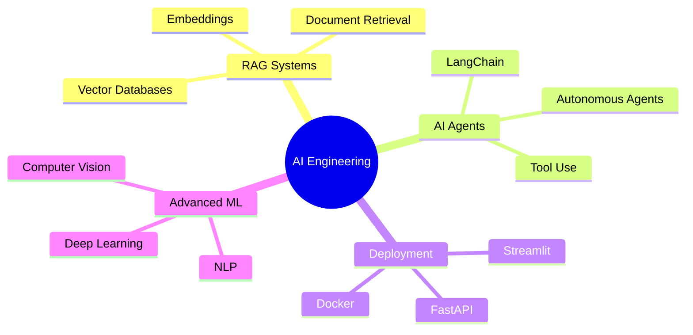

<div align="center">

# Hi there, I'm Enock 👋

### Data Scientist | ML Engineer | AI Enthusiast

*Building intelligent systems and exploring the intersection of data and AI*

[](https://github.com/poip-boop)
[](https://linkedin.com/in/yourprofile)

</div>

---

## 🎯 About Me

```python
class DataScientist:
    def __init__(self):
        self.name = "Enock"
        self.role = "AI/ML Engineer"
        self.interests = ["Machine Learning", "AI Agents", "Data Science"]
        self.currently_learning = ["RAG Systems", "LangChain", "AI Deployment"]
    
    def say_hi(self):
        print("Thanks for dropping by! Let's build something amazing together.")

me = DataScientist()
me.say_hi()
```

---

## 🚀 Featured Projects

<table>
<tr>
<td width="50%">

### 🤖 Mental Health AI Agent
*Intelligent mental health support powered by LLMs*

**Tech Stack:** FastAPI · Streamlit · LangChain · OpenAI

[](https://github.com/poip-boop/mental_health_AI_Agent)

</td>
<td width="50%">

### 📊 Retail Sales Forecasting
*Time series prediction with ML models*

**Tech Stack:** Python · Scikit-learn · Pandas · Prophet

[](https://github.com/poip-boop/retail-sales-forecasting)

</td>
</tr>

<tr>
<td width="50%">

### 🚢 Titanic Survival Predictor
*ML classification with Random Forest*

**Tech Stack:** Python · Scikit-learn · Pandas

[](https://github.com/poip-boop/Titanic_survivors_predictor_using_random_forest)

</td>
<td width="50%">

### 🔬 Linear Regression from Scratch
*Custom implementation inspired by Andrew Ng's ML course*

**Tech Stack:** NumPy · Pandas · Mathematics

[](https://github.com/poip-boop/Linear_regression_from_scratch_on_MPG)

</td>
</tr>
</table>

---

## 🛠️ Tech Stack

<div align="center">

### Languages


### Frameworks & Libraries


### Tools & Platforms


</div>

---

## 🌱 Currently Exploring



---

## 📊 GitHub Analytics

<div align="center">
  
  
</div>

<div align="center">
  
</div>

---

## 🏆 GitHub Trophies

<div align="center">
  
</div>

---

## 📈 Contribution Graph

<div align="center">
  
</div>

---

## 💬 Let's Connect

<div align="center">

[](https://linkedin.com/in/yourprofile)
[](https://twitter.com/yourhandle)
[](mailto:your.email@example.com)
[](https://yourportfolio.com)

</div>

---

<div align="center">
  
### 💭 Random Dev Quote


### ✨ Thanks for visiting! 


**⭐ From [poip-boop](https://github.com/poip-boop)**

</div>
